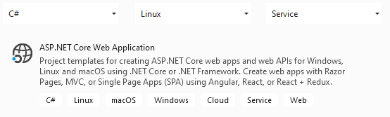
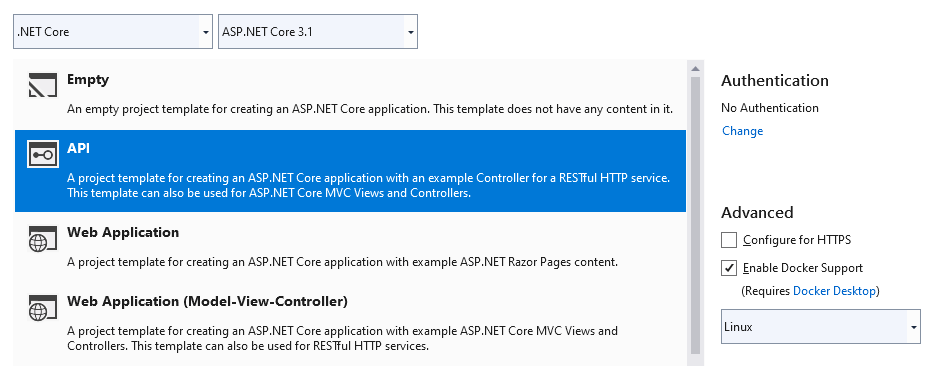

# trending-command-service
Trending CQRS Sample - Command microservice

# What You Need for This
 + Visual Studio 2019 - *or higher* - incl.:
    + C# stuff
    + .NET Core 3.1
    + Markdown Editor
 + Docker Desktop with Linux containers
 + Also recommended:
    + ReSharper
    + TortoiseGit
    + Notepad++ including XML Tools

# How This Was Created
Via Visual Studio project templates:

